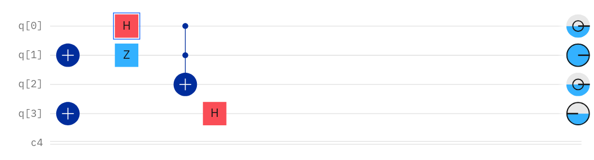
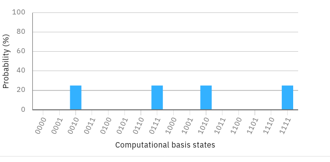
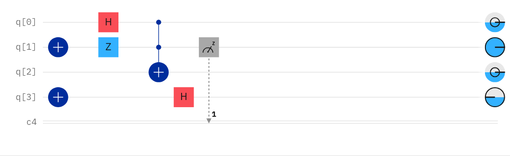
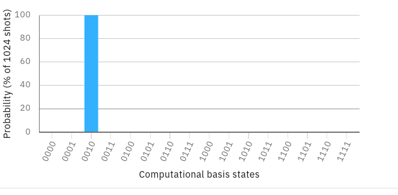
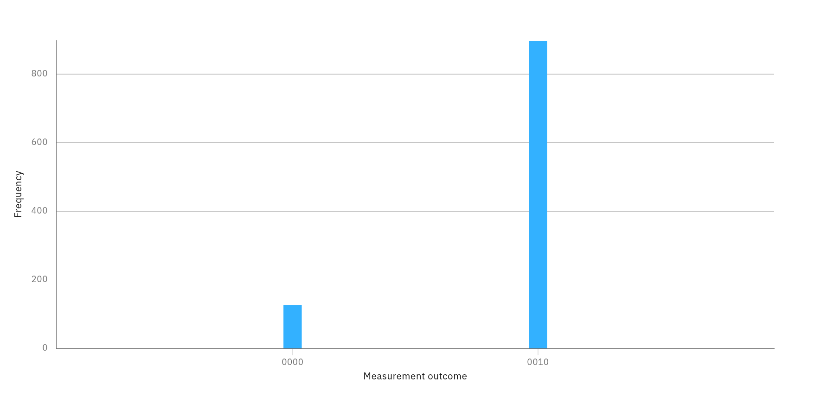

#+title: Trabajo Practico IBMQ
#+language: es
#+LATEX_HEADER: \usepackage[spanish]{babel}
#+LATEX_HEADER: \usepackage{braket}
#+LATEX_HEADER: \usepackage{amsmath}
#+LATEX_HEADER: \usepackage[margin=1.0in]{geometry}
#+author: Tomas Fabrizio Orsi - 109735
#+date: Primer Cuatrimestre 2025
#+subject: Trabajo Practico de Computacion Cuantica usando IBMQ
#+keywords: Computacion Cuantica, FIUBA
#+begin_export latex
\newpage
#+end_export
* Cicuito cuantico elegido
El circuito cuantico elegido para este trabajo es el siguiente:

[[file:images/ej8.png]]

Es el ejercicio 8 de la guia 7.

* Algortimo cuantico
En esta seccion vamos a desarrollar el algoritmo cuantico.

#+begin_export latex
\begin{align}
\ket{0101} \\
Z_2 \ket{0101} &= - \ket{0101} \nonumber \\
H_1 -\ket{0101} &= - \frac{1}{\sqrt{2}} (\ket{0101} + \ket{1101}) \nonumber \\
\text{Toff}_{1,2,3} - \frac{1}{\sqrt{2}} (\ket{0101} + \ket{1101}) &=  - \frac{1}{\sqrt{2}} (\ket{0101} + \ket{1111}) \nonumber \\
H_4 - \frac{1}{\sqrt{2}} (\ket{0101} + \ket{1111}) &= \frac{1}{2} (- \ket{0100} + \ket {0101} - \ket{1110} + \ket{1111}) \nonumber \\
\end{align}
#+end_export
* Colpaso del Qubit
En esta seccion vamos a calcular la probabilidad de que el qubit 3 colapse en 1.

#+begin_export latex
$$
P(1) = \braket{ \Psi | \mathbb{P}^\text{*} \mathbb{P} | \Psi }
$$
\begin{align*}
\mathbb{P} \ket{ \Psi } &= \frac{1}{2} (
- \ket{0} \otimes \ket{1}\bra{1}\ket{1} \otimes \ket{00}
+ \ket{0} \otimes \ket{1}\bra{1}\ket{1} \otimes \ket{01}
- \ket{1} \otimes \ket{1}\bra{1}\ket{1} \otimes \ket{10}
+ \ket{1} \otimes \ket{1}\bra{1}\ket{1} \otimes \ket{11}) \\
\mathbb{P} \ket{ \Psi } &= \frac{1}{2} (- \ket{0100} + \ket {0101} - \ket{1110} + \ket{1111}) \\
\bra{ \Psi } \mathbb{P^{\text{*}}} &= \frac{1}{2} (- \bra{0100} + \bra {0101} - \bra{1110} + \bra{1111}) \\
\braket{ \Psi | \mathbb{P}^\text{*} \mathbb{P} | \Psi } &= \frac{1}{4}  ( \braket{0100|0100} + \braket{0101|0101} + \braket{1110|1110} + \braket{1111|1111}) \\
\braket{ \Psi | \mathbb{P}^\text{*} \mathbb{P} | \Psi } &= \frac{1}{4}  (+ 1 + 1 + 1 + 1) \\
\braket{ \Psi | \mathbb{P}^\text{*} \mathbb{P} | \Psi } &= \frac{1}{4}  (4) \\
\braket{ \Psi | \mathbb{P}^\text{*} \mathbb{P} | \Psi } &= 1 \\
\end{align*}
#+end_export

Esto nos afirma que el qubit 2 deberia colapsar en 1 el 100% de la vez. El complemento tambien nos dice que nunca deberia colapsar a 0.

* Ejecucion del cicuito en IBMQ
El circuito en IBMQ se ve de la siguiente forma:

Antes de añadir la proyeccion podemos observar que el estado cuantico coincide con el de la resolucion en el insicio anterior[fn:1]

Al añadir la proyeccion al circuito:

Obtenemos las siguiente probabilidad:

Vemos que coinice con nuestra cuenta en el punto anterior: El segundo qubit deberia proyectar a 1.

Ahora, cuando ejecutamos el circuito 1024 veces obtenemos lo siguiente:

Vemos que no en todas las corridas el resultado es el esperado. De las mediciones, vemos que 897 veces (el %87.6) se obtiene 1, mientras que 127 veces (12.4%) de las veces obtenemos 0.

Esto refleja la realidad de la computacion cuantica: Nuestras cuentas estan basadas en casos ideales donde no existe ruido. Sin embargo, en la vida real, las computadoras cuanticas son muy sensibles a las condiciones del ambiente y por ende no son 100% consistentes. Es por esto que las computadoras cuanticas necesitan de muchos qubits fisicos para poder tener un qubit logico, necesitan mejores estimaciones de los resultados.

* Footnotes

[fn:1] Los qubits se tienen que leer de atras para adelante en IBMQ
