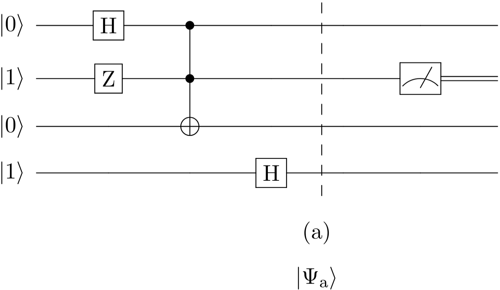

#+title: Trabajo Practico IBMQ
#+language: es
#+LATEX_HEADER: \usepackage[spanish]{babel}
#+LATEX_HEADER: \usepackage{braket}
#+LATEX_HEADER: \usepackage{amsmath}
#+LATEX_HEADER: \usepackage[margin=1.0in]{geometry}
#+author: Tomas Fabrizio Orsi - 109735
#+date: Primer Cuatrimestre 2025
#+begin_export latex
\newpage
#+end_export
* Cicuito cuantico elegido
El circuito cuantico elegido para este trabajo es el siguiente:

Es el ejercicio 8 de la guia 7.

* Algortimo cuantico
En esta seccion vamos a desarrollar el algoritmo cuantico.

#+begin_export latex
\begin{align}
\ket{0101} \\
Z_2 \ket{0101} &= - \ket{0101} \nonumber \\
H_1 -\ket{0101} &= - \frac{1}{\sqrt{2}} (\ket{0101} + \ket{1101}) \nonumber \\
\text{Toff}_{1,2,3} - \frac{1}{\sqrt{2}} (\ket{0101} + \ket{1101}) &=  - \frac{1}{\sqrt{2}} (\ket{0101} + \ket{1111}) \nonumber \\
H_4 - \frac{1}{\sqrt{2}} (\ket{0101} + \ket{1111}) &= \frac{1}{2} (- \ket{0100} + \ket {0101} - \ket{1110} + \ket{1111}) \nonumber \\
\end{align}
#+end_export
* Colpaso del Qubit
En esta seccion vamos a calcular la probabilidad de que el qubit 3 colapse en 1.

#+begin_export latex
$$
P(1) = \braket{ \Psi | \mathbb{P}^\text{*} \mathbb{P} | \Psi }
$$
\begin{align*}
\mathbb{P} \ket{ \Psi } &= \frac{1}{2} (
- \ket{0} \otimes \ket{1}\bra{1}\ket{1} \otimes \ket{00}
+ \ket{0} \otimes \ket{1}\bra{1}\ket{1} \otimes \ket{01}
- \ket{1} \otimes \ket{1}\bra{1}\ket{1} \otimes \ket{10}
+ \ket{1} \otimes \ket{1}\bra{1}\ket{1} \otimes \ket{11}) \\
\mathbb{P} \ket{ \Psi } &= \frac{1}{2} (- \ket{0100} + \ket {0101} - \ket{1110} + \ket{1111}) \\
\bra{ \Psi } \mathbb{P^{\text{*}}} &= \frac{1}{2} (- \bra{0100} + \bra {0101} - \bra{1110} + \bra{1111}) \\
\braket{ \Psi | \mathbb{P}^\text{*} \mathbb{P} | \Psi } &= \frac{1}{4}  (- \braket{0100|0100} + \braket{0101|0101} - \braket{1110|1110} + \braket{1111|1111}) \\
\end{align*}
#+end_export
