#+title: resumen
#+LATEX_HEADER: \usepackage{braket}
#+LATEX_HEADER: \usepackage{amsmath}

* Algebra pre-eliminar
** Operaciones
*** Conjugar
Consiste en cambiarle el signo a la parte imaginaria
${ z = a + ib \rightarrow z^* = a - ib }$ 

*** Transponer
Consiste en pasar de un vector fila a columna y viceversa.
*** Conjugar hermitico
Consiste en conjugar y transponer un vector
Se represneta con una ${ \text{daga}\textsuperscript{\textdagger} }$ 

*** Autovectores y autovalores
Sea una matriz ${ \hat A }$ cuyo espectro de autovalores no degenerado (cada autovalor tiene multiplicad 1); cada autovalor tiene un autovector asociado. Ademas se cumple:

${ \hat A \cdot v_n = a_n \cdot v_n}$
** Funciones booleanas
*** Balanceadas
Decimos que una funcion booleana es constante cuando la respuesta siempre es lo mismo independientemente del output.
Ejemplo:
| Constante                     | Balanceada                    |
|-------------------------------+-------------------------------|
| ${ f(0) = 0 \land f(1) = 0 }$ | ${ f(0) = 1 \land f(1) = 0 }$ |
| ${ f(0) = 1 \land f(1) = 1 }$ | ${ f(0) = 0 \land f(1) = 1 }$ |

* Notacion de Dirac
** Elementos
*** Kets
Representa un *vector columna*.
${ \ket{\Phi}  }$
*** Bra
Representa un *vector fila*.
${ \bra{\Omega}  }$

*** Operador
Matriz que modifica a un ket o a un bra.

** Propiedades

*** Propiedad 1
Todo ket de siempre tiene un bra asociado, que es su conjugado hermítico.

${ \ket{\Phi}}$ 

*** Propiedad 2
Cuando se extrae un escalar complejo del interior de un ket, sale sin conjugar.

${ \ket{ a \cdot \Phi }  = a \cdot \ket{ \Phi } }$ 

*** Propiedad 3
Cuando se extrae un escalar complejo del interior de un bar, sale *conjugar*.

${ \bra{ a \cdot \Phi }  = a^* \cdot \bra{ \Phi } }$

*** Propiedad 4
Una combinación lineal de kets es un ket y una combinación lineal de bras es un bra. Los coeficientes de la combinación lineal son escalares complejos.
No se puede hacer una combinación lineal de bra y kets !!!

*** Propiedad 5
Producto interno: El producto interno de dos kets se llama *BraKet* y se representa: ${ \braket{\Phi|\Omega} }$

1. Como dice el nombre, tenes que llevar el ket de la izquierda a un bra para poder realizar la operacion.
2. Para eso, usas el bra asociado del ket. Eso va a darte un bra, pero con todos los elementos conjugados.
[[file:images/Propiedad4.png]]

*No es conmutativo*.

*** Propiedad 6
El braket (producto interno) de un ket consigo mismo ${ \braket{\Phi|\Phi} }$, es el cuadrado de la norma del ${ \ket \Phi }$.

*** Propiedad 7
En computación cuántica se trabaja con bases ortonormales del espacio.
Base ejemplo: ${\{ \ket \Phi, \ket \Omega \}}$

Esto se da cuando:
1. Los kets que lo forman son ortogonales entre si: ${ \braket{\Phi|\Omega} = 0}$.
2. Los vectores de la base son de norma uno ${ \braket{\Phi|\Phi} = 1}$

**** Base computacional
Se utiliza la siguiente base ortonormal:

{ \ket 0 =
\begin{pmatrix}
    1 \\
    0
\end{pmatrix},
\ket 1 =
\begin{pmatrix}
    0 \\
    1
\end{pmatrix}
}

Es decir, todo vector se puede escribir como combinacion lineal de estos:
${\ket \Phi =
\begin{pmatrix}
\alpha \\
\beta
\end{pmatrix}}$

${\ket \Phi = \alpha \ket 0 + \beta \ket 1}$

*** Propiedad 8
Para que un ket pueda representar un estado cuántico, su norma debe valer 1. Es decir: ${ \sqrt{\braket{\Phi|\Phi}} = 1 }$ 

*** Propiedad 9[fn:1] 
El producto interno de dos kets da como resultado un operador lineal. Se denota: ${ \ket \Phi \bra \Omega }$ 

[[file:images/Propiedad9.png]]

Al igual qie con las matrices tradicionales, cuando se le aplica a un ket da otro ket.

* Operadores
** Hermiticos
** Unitarios
** Proyeccion
Dado un ket de norma 1, la proyeccion se define como ${ \hat P_{\ket{\Phi}} = \ket \Phi \bra \Phi}$ siempre que ${ \Phi }$ este expresado como BON.
* Postulados de la Mecanica cuantica
** Postulado 1
#+begin_quote
Todo sistema cuantico tiene un espacio vectorial *complejo* con producto interno conocido como espacio de estados.

El estado cuantico del sistema queda completamente desctipto por un ket de estado ${ \ket \Psi (t) }$ normalizado.
#+end_quote

Esto quiere decir que todo sistema tiene un conjunto de "infinitos" estados en los que puede estar el sistema. En si, el estado cuantico en un momento ${ t }$ se llama ${ \ket \Psi }$.

Sigue aplicando el principio de superposicion, la combinacion lineal de kets de estado; es un ket de estado. Ademas, si un sistema puede estar en estado ${ \ket a }$ y ${ \ket b }$; puede estar en una superposicion lineal de dichos estados.

Dado el espacio formado por la base ortonormal ${ B = \{ \ket \phi_1, \dots \ket \phi_n \} }$; el estado cuantico "generico" se puede escribir:

${ \ket \Psi (t) = c_1 (t) \ket \phi_1 + \dots  c_n (t) \ket \phi_n}$

Cada una de las ${ c }$ representan amplitudes de probabilidad en un momento dado ${ t }$.
Estas ${ c }$ se van modificando por el uso de compuertas cuanticas.

Ademas, como el ket esta normalizado se cumple:

${ \displaystyle\sum_{i = 1}^n | c_i(t)|^2 }$
** Postulado 2
Cada cantidad física medible ${ \mathcal A }$  se describe mediante un operador hermítico ${ \hat A }$   que actúa sobre kets del espacio de estados del sistema. Este operador ${ \hat A }$  es un observable.
*** Observable
Decimos que un operador hermitico es observable si *su base ortonormal de autovectores tambien forma una base ortonormal del espacio de estados del sistema*.
** Postulado 3

Los unicos resultados posibles de una mediciohn con una cantidad fisica ${ \mathcal A }$ es *alguno de los autovalores* del operador hermitico correpondiente ${ \hat A }$.

Observaciones:
- Para obtener los autovalores de un operador hermítico ${ \hat A }$ se diagonaliza la matriz A asociada a dicho operador en una dada base.
- Una medición de la cantidad física A siempre da como resultado un valor real
- Como el espectro de autovalores es discreto[fn:2], se dice que los resultados que se pueden obtener al medir la cantidad física A están cuantizados.
*** Spin
Una representacion fisica de este postulado es el del Spin.
Este, es una propiedad que tienen algunas particulas; lo importante para la materia es que *cuando mido la proyeccion spin, me da 1 o -1; NADA MAS*.

Esto es justamente la "implementacion" del postulado; tengo una propiedad que esta en una superposicion de estados, pero *apenas lo mido colapsa a 1 o -1*.
** Postulado 4
Cuando se mide la cantidad fisica a un estado cuantico, la probabilidad de obtener el autovalor ${ a_n }$ es:

${ \mathbb{P}(a_n) = |\braket{\phi_n|\Psi(t)}|^2 = |c_n(t)|^2}$ 

Es decir; podes obtener la probabilidad de obtener un autovalor antes de medir el estado cuantico.

${ \mathbb{P}(a_n) = |\braket{\phi_n|\Psi(t)}|^2 = |c_n(t)|^2}$ 
*** Autovalores degenerados
En caso de que haya autovalores degenerados, se puede hallar asi:

${ \displaystyle \sum_{i = 1}^q |c_i|^2  }$ 

Siendo ${ q }$  la cantidad de autovalores distintos.
*** Fase global
Decimos que ${ \ket \Psi }$ y ${ \ket \psi }$ difieren en una fase global si se da lo siguiente:
${ \ket \psi = e ^{i \cdot \theta} \ket \Psi }$
**** Probabilidades predichas
Las probabilidades predichas para una medicion arbitraria son las mismas para ambos.

*Difieren matematicamente, pero fisicamente son iguales*. Esto implica que *representan el mismo estado cuantico*.

** Postulado 5: Reduccion o colapso del estado de un Ket.
Cuando medis un ket, pierde las propiedades cuanticas. El observable ${ \hat A }$  representa la cantidad fisica subyaciente y tenes ${ \ket \Psi (t) }$  que describe el estado cuantico antes de medir.

Cuando vos lo medis pueden darse varias cosas:

*** Caso 1: ${ \hat A }$ tiene autovalores discretos no repetidos
El resultado de la medicion es ${ a_n }$. ${ a_n }$  tiene asociado el autovector ${ \ket {\phi_n }}$.

*El estado del sistema despues de realizar la medicion es el autovector ${ \ket {\phi_n} }$.*

Este nuevo estado evoluciona segun [[Postulado 6]].

*** Caso 2: ${ \hat A }$ tiene autovalores discretos repetidos (degenerados)

Si la medicion da un auto valor que esta asociado a varios autovectores, el resultado /inmediatamente despues/ es la proyeccion normalizada de ${ \ket {\Phi(t)} }$ sobre el autoespacio generado por todos los autovectores asociados a ese autovalor (digamos ${  \phi_1, \phi_2, \phi_k  }$) . A esa proyeccion la llamamos ${ \hat P_n }$  y se obtiene:  ${ \hat P_n = \ket \phi_1 \bra \phi_1 + \ket \phi_2 \bra \phi_2 + \ket \phi_k \bra \phi_k }$ .

${ \ket {\widetilde \Phi } = \frac{\hat P_n \ket {\Phi (t)}}{\sqrt{\bra \Phi \hat P_n \textsuperscript{\textdagger} \hat P_n \ket \Phi}}}$.

** Postulado 6
La evolucion de un sistema cuantico se puede describir mediante una transformacion unitaria.

* TODO Experimento Stern-Gerlach
* Qubit
Objeto matematico cuyo estado es un ket normalizado.

Puede hallarse en una superposicion cuantica (combinacion lineal) de estados.

${\ket \Phi = \alpha \ket 0 + \beta \ket 1}$

${ \alpha \text{ y } \beta }$ son amplitudes de probabilidad y pueden ser complejos. El [[Postulado 4]] nos indica que representan la probabilidad de que, si se realiza una medicion, el ket de estado se proyecte sonbre los autovectores asociados.
** Base ortonormal
La BON ${ B = \{ \ket 0, \ket 1 \} }$ tienen distintas implementaciones fisicas dependendiendo del qubit subyaciente
- Los estados vertical y horizontal de la polarizacion de un foton.
- Los estados diagonal y anti-diagonal de la polarizacion de un foton.
- Los estados spin up y spin down de un foton.
** Esfera de Bloch
Vos podes expresar el qubit en la esfera de Bloch.

Te queda:

${ \ket \phi = cos(\frac{\theta}{2}) \ket 0 + sen(\frac{\theta}{2}) e^{i \cdot \phi} \ket 1}$

- ${ \theta }$ y ${ \phi }$ descrinen un punto sobre la esfera de radio 1.

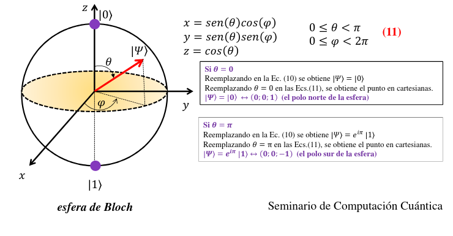
*** Ejemplo:

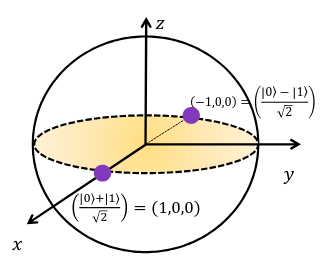
** Estados de 2 Qubits
El estado generico se puede escribir:
#+begin_export latex
$$
\ket \Phi = (a \ket 0 + b \ket 1) \otimes (c \ket 0 + \d \ket 1)
\ket \Phi = ac \ket{00} + ad \ket {01} + bc \ket{10}  + bd \ket {11}
$$
#+end_export
Entonces, si vos te dan un ${ \Phi }$, vos podes hallar los valores originales de los ket si resolves un sistema de ecuaciones.
*** Estados producto
Se dice que es un estado producto o estado separable si puede escribirse como un producto tensorial de los estados de cada qubit.
Matimaticamente:
#+begin_export latex
$$
\ket \Phi = \ket{\psi}_a \otimes \ket{\psi}_b
$$
#+end_export
Siendo ${ \ket \Phi }$ el estado del sistema de 2 qubits, y los otros kets son cada ket.
Cuando se da esto, el estado de un ket *no tiene influencia sobre el otro*, es decir los resultados de las mediciones no están correlacionados.

*** Estados entrelazados
Se dice que es un estado producto o estado separable si /*NO*/ puede escribirse como un producto tensorial de los estados de cada qubit.
Ejemplo:
#+begin_export latex
$$
\ket \Phi = 0 \ket{00} + 1 \ket{01} + 1 \ket 0
$$
#+end_export
Si tratas de hallar ${ a,b,c,d }$ , te da un absurdo.

**** Entrelazamiento cuantico
Cuando 2 qubits están entrelazadas, tienen un estado *cuantico compartido*. Esto quiere decir, que el resultado de medir una particula NO es independiente de la otra. Si vos medis una, *el estado cuantico se parte*; lo cual implica que sabes que va a medir a la otra particula.

* Producto tensorial
Sea dos kets ${ \ket V }$ y ${ \ket W }$, ${ \ket v \otimes  \ket w }$ (abreviado a ${ \ket {vw} }$ da un espacio vectorial de dimension ${ n_v \cdot n_w }$.

Consiste en hacer la distributiva de cada ket entre si, muchos se terminan cancelando.

#+begin_export latex
$$
\begin{aligned}

\ket V \otimes \ket W = (a \ket 0 + b \ket 1) + (c \ket 2 + d \ket 3 + e \ket 4)

\ket V \otimes \ket W = ac \ket {02} + ad \ket {03} + ae \ket {04} + bc \ket {12} + bd \ket {13} + be \ket {14}

\end{aligned}
$$
#+end_export
** Propiedades
*** No es conmutativo
*** Aplicacion de escalares

#+begin_export latex
$$
\alpha (\ket v \otimes \ket w) = (\alpha \ket v) \otimes \ket w = \ket v \otimes (\alpha \ket w)
$$
#+end_export
*** Distributiva
Aplica incluso si ${ \ket w }$ esta adelante del parentesis sumando
#+begin_export latex
$$
(\ket v_1 + \ket v_2) \otimes \ket w = \ket v_1 \otimes \ket w + \ket v_2 \otimes \ket w
$$
#+end_export
*** Distributiva de operadores lineales
#+begin_export latex
$$
\hat A \otimes \hat B (\ket v \otimes \ket w) = \hat A \ket v \otimes \hat B \ket w
$$
#+end_export
*** Conjugado hermitico
#+begin_export latex
$$
(\ket v \otimes \ket w)\textsuperscript{\textdagger} = \ket v \textsuperscript{\textdagger} \otimes \ket w \textsuperscript{\textdagger} = \bra v \otimes \bra w
$$
#+end_export
*** Producto interior
#+begin_export latex
$$
\braket{\alpha|\beta} = \braket{v_1w_1|v_2w_2} = \braket{v_1|v_2} \braket{w_1|w_2}
$$
#+end_export
*** Proyectores
${ \hat P_V }$  es un proyector sobre ${ V }$ y ${ \hat P_W  }$ es un proyector sobre ${ W }$.
#+begin_export latex
$$
\hat P_V \otimes \hat P_W = (\sum_{i=1}^r \ket v_i \bra v_i ) \otimes (\sum_{j=1}^r \ket w_j \bra w_j) = \sum_{i,j} \ket v_i \bra v_i \otimes \ket w_j \bra w_j
$$
#+end_export

* Compuertas cuanticas de 1 Qubit
Una computadora cuántica se construye a partir de un circuito cuántico que contiene
- cables: Transmiten informacion
- Puertas cuánticas: Manipulan el estado cuantico de la informacion

Las compuertas cuanticas son operadores unitarios.
** Identidad
Identificada con ${ I }$.
*** Efecto BON
#+begin_export latex
$$
I \ket 0 = \ket 0
I \ket 1 = \ket 1
$$
#+end_export
*** Representacion matricial
#+begin_export latex
$$
\begin{bmatrix}
    1 & 0 \\
    0 & 1 \\
\end{bmatrix}
$$
#+end_export
** Negacion
Identificada con ${ X }$ .
*** Efecto BON
#+begin_export latex
$$
X \ket 0 = \ket 1
X \ket 1 = \ket 0
$$
#+end_export
*** Representacion matricial
#+begin_export latex
$$
\begin{bmatrix}
    0 & 1 \\
    1 & 0 \\
\end{bmatrix}
$$
#+end_export
*** Efecto en la esfera
Hace girar el qubit en el eje.
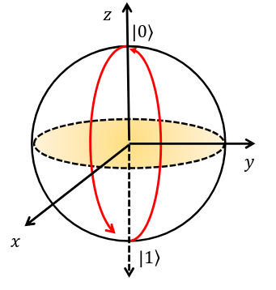
*** Efecto en el ket:
${ \ket \Phi = \alpha \ket 0 + \beta \1 }$ 
${ X \ket \Phi = \beta \ket 0 + \alpha \ket 1 }$ 
** Puerta Z
*** Efecto BON
#+begin_export latex
$$
Z \ket 0 = \ket 0
Z \ket 1 = - \ket 1
$$
#+end_export
*** Representacion matricial
#+begin_export latex
$$
\begin{bmatrix}
    1 & 0 \\
    0 & -1 \\
\end{bmatrix}
=
\begin{bmatrix}
    1 & 0 \\
    0 & e^{i\pi} \\
\end{bmatrix}

$$
#+end_export
*** Efecto en la esfera
Produce una rotacion de angulo ${ \pi }$ sobre el eje Z
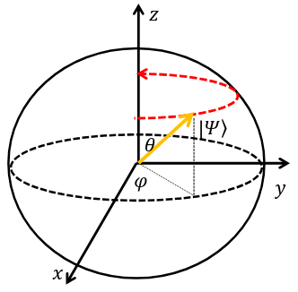

*** Efecto en el ket:
${ \ket \Phi = cos(\frac{\theta}{2}) \ket 0 + sin(\frac{\theta}{2}) e^{i \cdot \varphi} }$
${ Z \ket \Phi = cos(\frac{\theta}{2}) \ket 0 + sin(\frac{\theta}{2}) e^{i \cdot (\varphi + \pi)} }$

** Puerta Y
Replica el efecto de aplicar Z y luego X al ket, con una fase global.
${ Y \ket \Phi = e^{i \cdot \frac{\pi}{2}} X Z }$ ${ \ket \Phi }$ .
*** Efecto BON
#+begin_export latex
$$
Y \ket 0 = i \ket 1
Y \ket 1 = -i \ket 0
$$
#+end_export
*** Representacion matricial
#+begin_export latex
$$
\begin{bmatrix}
    0 & -i \\
    i &  0 \\
\end{bmatrix}
$$
#+end_export
** Puerta de corrimiento de fase ${ R_z (\delta) }$ 
Representa una familia de compueras, cada una tomando un valor distinto de ${ \delta }$.
genera una rotación antihoraria (si ${ \delta > 0 }$ ) o una rotación horaria (si ${ \delta < 0 }$) del qubit alrededor del eje z en la esfera de Bloch
*** Efecto BON
#+begin_export latex
$$
R_z(\delta) \ket 0 = \ket 0
R_z(\delta) \ket 1 = e^{i \cdot \delta} \ket 0
$$
#+end_export

*** Representacion matricial
#+begin_export latex
$$
\begin{bmatrix}
    1 &  0 \\
    0 &  e^{i \cdot \delta} \\
\end{bmatrix}
$$
#+end_export
*** Efecto en el ket
${ \ket \Phi = cos(\frac{\theta}{2}) \ket 0 + sin(\frac{\theta}{2}) e^{i \cdot \varphi} }$
${ R_z (\delta) \ket \Phi = cos(\frac{\theta}{2}) \ket 0 + sin(\frac{\theta}{2}) e^{i \cdot (\varphi + \delta )} }$
** Puerta de Hadamard
*Puerta super importante*, agarre un qubit y lo pone en un estado de superposicion.

Ademas, es involutiva, si aplicas Hadamard dos veces, vuelve al original.
*** Efecto BON
#+begin_export latex
$$
H \ket 0 = \frac{\ket 0 + \ket 1}{\sqrt 2}
H \ket 1 = \frac{\ket 0 - \ket 1}{\sqrt 2}
$$
#+end_export

*** Representacion matricial
#+begin_export latex
$$
\frac{1}{\sqrt 2}
\begin{bmatrix}
    1 &  1 \\
    1 &  1 \\
\end{bmatrix}
$$
#+end_export

*** Efecto en la esfera
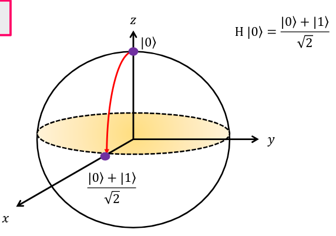

* Compuertas de 2 qubits
** Producto tensorial aplicado a las compuertas.
Lo lindo del producto tensorial es que aplica las compuertas a los qubits 1 a 1.
Se cumple que ${ \ket{x_1 x_2} = \ket{x_1} \otimes \ket{x_2} }$ y tambien se cumple ${ U \otimes V \ket{x_1 x_2} = U \ket{x_1} \otimes V \ket{x_2} }$.

** Compuertas de 1 qubit pero con dos
Funcionan igual que las compuertas de 1 qubit pero tienen un subindice indicando a que qubit afectan.
** Waslh Hadamard
Son simplemente dos compuertas de hadamard, una a cada qubit.
${ W = H \otimes H }$ 
** CNOT
Esta es una compuerta no separable, es decir que afecta a los dos qubits.

Realiza una operacion de XOR en los qubits, almacena el resultado en el 2do qubit.
Esto se puede ver como "Si el bit de control esta prendido, altera el segundo".
| Qubit de Control | 2do qubit | Qubit resultado (almacenado en el 2do) |
|------------------+-----------+----------------------------------------|
|                0 |         0 |                                      0 |
|                0 |         1 |                                      1 |
|                1 |         0 |                                      1 |
|                1 |         1 |                                      0 |

El de control es el del circulo negro, el resultado es la X
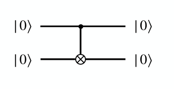

** Swap
Intercambia los qubit
${ S \ket{x_1 x_2} = \ket{x_2 x_1} }$

** CPH(${ \delta }$)
Aplica un corrimiento de fase al qubit objetivo (target) sólo cuando el qubit de control se encuentra en 1.
| Qubit de Control | 2do qubit | Qubit resultado (almacenado en el 2do) |
|------------------+-----------+----------------------------------------|
|                0 |         0 | 0                                      |
|                0 |         1 | 1                                      |
|                1 |         0 | 0[fn:3]                                |
|                1 |         1 | ${e^{i \cdot \delta}}$                 |
* Compuertas de 3 qubits
** Toffoli
Los dos primeros qubits son de control y el 3ro es el objetivo.
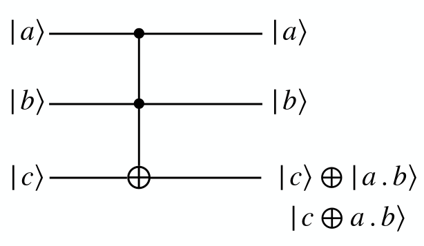

Realiza: C XOR (A and B) y almacena el resultado en C

** Fredkin (Controlled swap)
Realiza la sigiente operacion

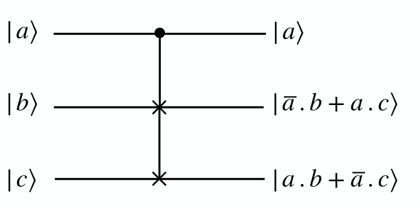

El + es "and" y el ${ \cdot  }$ es "or".

Funciona igual que la not controlada ocn un unico target pero afecta a varios targets.

*NO es una compuerta equivalente, tienen distinta matriz*.

** Compuerta U controlada

TIene 1 qubit de control y n afectados.
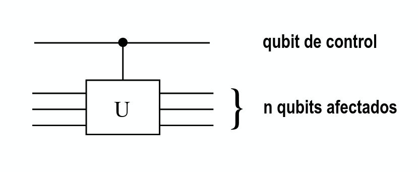

** Compuerta oraculo
*** Funcion booleana
La compuerta oraculo viene asociada a una funcion booleana ${ f(x) }$ toma como entrada strings de 1 y 0 de longitud ${ n }$ y tiene una salida de 1 bit.

*** Qubits
${ \ket x }$ es un string de bits de longitd n
${ \ket y }$ es un qubit de control

Entonces ${ U_f \ket{x, y} = \ket{x,y \oplus f(x) }}$. (${ \oplus }$ es xor.)

${ \ket y }$ es un solo qubit "oraculo". *${ \ket y }$ cambia si ${ f(x) = 1 }$* y permance igual si ${ f(x) = 0 }$.
El ${ \ket x }$ queda igual.

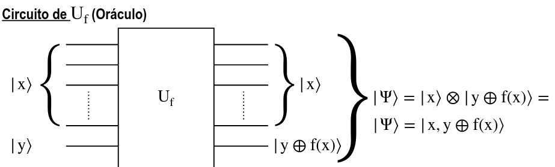

*** Propiedades
Cumple con la siguiente propiedad

${ U_f [\ket x \otimes (\ket 0 - \ket 1)] = (-1)^{f(x)} \ket x \otimes (\ket 0 - \ket 1)}$.

** Transformada de Hadamard
N compuertas de Hadamard en n qubits.
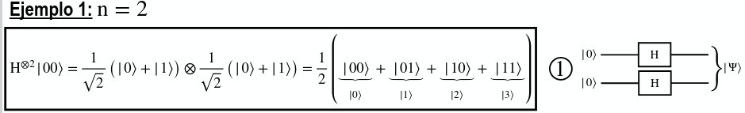
Aca se ve que te quedan todos los qubits de la bon. Esto pasa si tenes ${ \ket 0 }$.

Generalizada (para cualquier ket), queda

${ H^{\otimes n} \ket{x}^{\otimes n} = \frac{1}{\sqrt{2^n}} \displaystyle{\sum^{2^n -1 }_{x=0}} (-1) ^ {\bar x \cdot \bar y} \ket y }$

Siendo:
- ${ \ket{a b} = \ket x }$
- ${ \ket{a} = \ket y }$
- ${  \bar x \cdot \bar y }$ es el producto interno entre el ket x e y.

* Circuitos cuanticos
** Simbolos
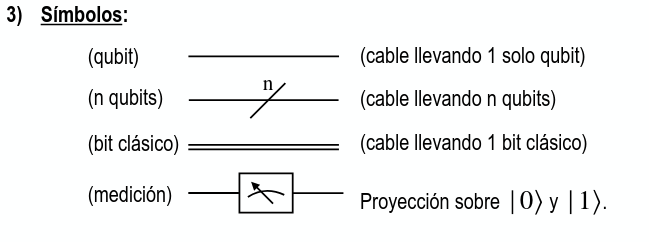
** Mediciones
Las mediciones se hacen a traves de ${ \hat M _m }$. ${ m }$ refiere a las posibles resultados de las mediciones.
Dado ${ \ket \Psi }$,
- La prob de que ocurra ${ m }$:  ${ \mathbb{P}(m) = \braket{\Psi|M_m| \Psi} }$
- El estado despues de medir: ${ \ket{\widetilde \Psi} = \frac{M_m \ket \Psi}{\sqrt{\braket{\Psi|M_m|\Psi}}} }$

* TODO Paralelismo cuantico
* Algoritmos cuanticos
** Deutch
Es un algoritmo que nos dice si una funcion es balanceada o constante usando *una unica medicion*.

*** Pasos
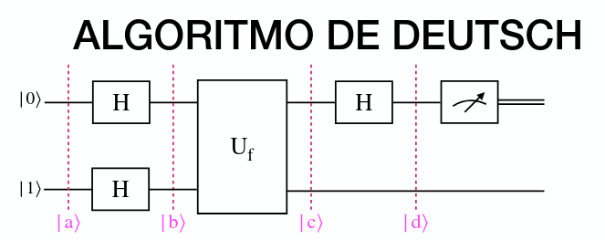
1. Tenes que tener el estado inicial en ${ \ket{01} }$ 
2. Aplicar la compuerta de Hadamard en paralelo al estado inicial
3. Aplicar ${ U_f }$ al estado obtenido
4. Aplicas Hadamard al primer qubit.
5. Realizas una medicion en el primer qubit de la salida.

Antes de medir, el estado es:
| Constante                                                    | Balanceado                                                   |
|--------------------------------------------------------------+--------------------------------------------------------------|
| ${ \pm \frac{1}{\sqrt{2}} \ket 0 \otimes (\ket 0 - \ket 1)}$ | ${ \pm \frac{1}{\sqrt{2}} \ket 1 \otimes (\ket 0 - \ket 1)}$ |

Despues de medir, el resultado te dice cual es el valor de la medicion
- Si medis 0, es constante
- Si medis 1, es balanceado

** Deutch - Jozsa
Generalizacion de deutch para N qubits. Si f(x) es constante, valo lo mismo para todos los x.
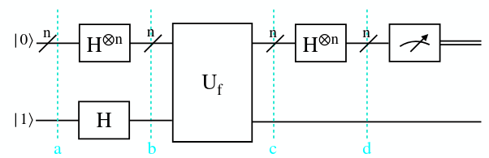

El estado antes de medir es:
${ \frac{1}{2^n} \displaystyle{\sum^{2^n-1}_{y=0}} (\displaystyle{\sum^{2^n-1}_{x=0}} (-1)^{f(x) + \bar x \cdot \bar y}) \ket y \otimes (\frac{\ket 0 - \ket 1}{ \sqrt 2})}$

** Protocolo de teleportacion cuantica
Objetivo: El objetivo de esta técnica es transmitir el estado cuántico de un qubit mediante el envío de 2 bits clásico

Alice tiene en su poder una partícula en el estado cuántico y desea transferirle a Bob el estado de dicha partícula (pero NO puede enviar la partícula) Alice NO conoce el estado de su qubit ${ \ket \Psi }$ y sólo puede enviarle a Bob información clásica

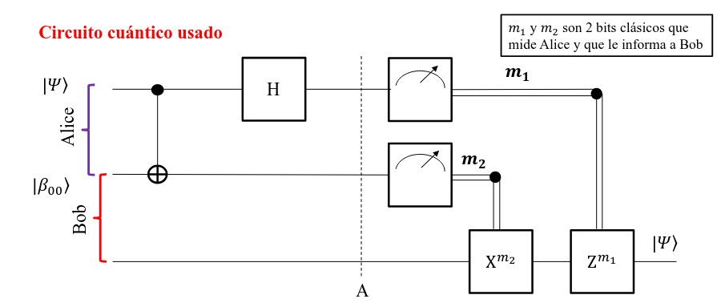

*** Pasos
1. Alice tiene dos qubits: ${ \ket \Psi }$ (el qubit que quiere enviar) y otro qubit que usara con bob para entrelazar.
2. Alice y Bob entrelazan el estado de dos qubits y se separan especialmente
3. Alice aplica compuertas a ${ \Psi }$
   1. Alice hace CNOT a los dos qubits usando como qubit de control el qubit ${ \Psi }$.
   2. Alice aplica Hadamard a ${ \Psi }$.
4. Alice mide y le envia la informacion via un canal clasico.
5. Dependendiendo de los dos bits obtenidos, Bob tiene que hacer unas operaciones sobre el qubit
   1.
      | Bits recibidos | Compuertas a aplicar |
      |----------------+----------------------|
      |             00 | Z^0 X^0              |
      |             01 | Z^0 X^1              |
      |             10 | Z^1 X^0              |
      |             11 | Z^1 X^1              |

** Protocolo de codificacion densa
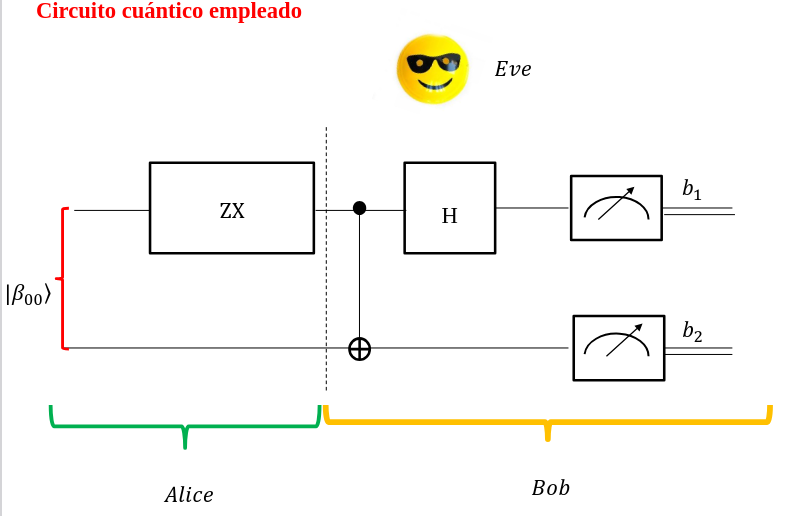

*** Pasos:
1. Se separan con qubits entrelazados
2. Dependendiendo de los bits que queres enviar
   1. 
       | Bits a enviar | Compuertas a aplicar |
       |----------------+----------------------|
       |             00 | Z^0 X^0              |
       |             01 | Z^0 X^1              |
       |             10 | Z^1 X^0              |
       |             11 | Z^1 X^1              |
3. Alice le envia el qubit (de forma cuantica)
4. Se aplican compuertas
   1. CNOT usando el de Alice de control
   2. Hadamard a al de control
5. Medis los dos quits
6. Sabes que era lo que queria enviar alice con u solo qubit.

** BB84
Es un protocolo que requiere de un canal clasico.
Usa foton como qubit, y usa dos bases:
- Horizontal y Vertical
- Antidiagonal y Diagonal

*** Pasos
1. Alice y Bob comuncian por un canal clasico el protocolo que can a usar:
   1. Si horizonntal representa 0 y Vertical 1 (o al reves). Mismo con Diagonal y antidiagonal
2. Genera un string de bits al azat
3. Para cada bit, elige aleatoriamente una de las dos bases y codifica un foton de acuerdo al protocolo
4. Cuando bob mide cada foton, no sabe con que base lo codifico alice; asique va a medir cada foton con una de las bases que reciba.
   1. Bob tambien elige al azar con que base medir
5. Se realiza la reconciliacion de las bases
   1. Se comunican por un canal clasico las bases que uso cada uno en cada uno de los bits.
   2. Bob informa con que base uso cada bit. Alice contesta SI O NO dependendiendo si la base coincide on no.
   3. A Eve no le sirve esta informacion ya que los fotones ya pasaron.
6. aLICE Y BOB borran de sus respectivos strings los bits en los que se han usado bases diferentes y se quedan con el resto de los string.

*** Teorema de la no clonacion
No se puede clonar un qubit arbitrario. Ya que no se puede hacer una copua perfecta de un qubit.

*** Seguridad
- Si eve interfiere en el string enviado a Bob, esto va a generar discrepancias con la clave de Bob.
- En la vida real, los sistemas de distribucion cuanticos, tienen erroes.
  - Para esto es importante determinar una cota de error.

* Footnotes

[fn:1] En clase no lo vimos como propiedad 9 como tal, lo pongo asi para simplificar

[fn:2] Al menos en la materia.

[fn:3] Esta la deja intacta
