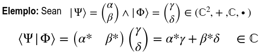
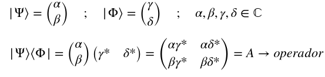

#+title: resumen
#+LATEX_HEADER: \usepackage{braket}

* Algebra pre-eliminar
** Operaciones
*** Conjugar
Consiste en cambiarle el signo a la parte imaginaria
${ z = a + ib \rightarrow z^* = a - ib }$ 

*** Transponer
Consiste en pasar de un vector fila a columna y viceversa.
*** Conjugar hermitico
Consiste en conjugar y transponer un vector
Se represneta con una ${ \text{daga}\textsuperscript{\textdagger} }$ 

* Notacion de Dirac

** Elementos
*** Kets
Representa un *vector columna*.
${ \ket{\Phi}  }$
*** Bra
Representa un *vector fila*.
${ \bra{\Omega}  }$

*** Operador
Matriz que modifica a un ket o a un bra.

** Propiedades

*** Propiedad 1
Todo ket de siempre tiene un bra asociado, que es su conjugado hermítico.

${ \ket{\Phi}}$ 

*** Propiedad 2
Cuando se extrae un escalar complejo del interior de un ket, sale sin conjugar.

${ \ket{ a \cdot \Phi }  = a \cdot \ket{ \Phi } }$ 

*** Propiedad 3
Cuando se extrae un escalar complejo del interior de un bar, sale *conjugar*.

${ \bra{ a \cdot \Phi }  = a^* \cdot \bra{ \Phi } }$

*** Propiedad 4
Una combinación lineal de kets es un ket y una combinación lineal de bras es un bra. Los coeficientes de la combinación lineal son escalares complejos.
No se puede hacer una combinación lineal de bra y kets !!!

*** Propiedad 5
Producto interno: El producto interno de dos kets se llama *BraKet* y se representa: ${ \braket{\Phi|\Omega} }$

1. Como dice el nombre, tenes que llevar el ket de la izquierda a un bra para poder realizar la operacion.
2. Para eso, usas el bra asociado del ket. Eso va a darte un bra, pero con todos los elementos conjugados.

*No es conmutativo*.

*** Propiedad 6
El braket (producto interno) de un ket consigo mismo ${ \braket{\Phi|\Phi} }$, es el cuadrado de la norma del ${ \ket \Phi }$.

*** Propiedad 7
En computación cuántica se trabaja con bases ortonormales del espacio.
Base ejemplo: ${\{ \ket \Phi, \ket \Omega \}}$

Esto se da cuando:
1. Los kets que lo forman son ortogonales entre si: ${ \braket{\Phi|\Omega} = 0}$.
2. Los vectores de la base son de norma uno ${ \braket{\Phi|\Phi} = 1}$

**** Base computacional
Se utiliza la siguiente base ortonormal:

{ \ket 0 =
\begin{pmatrix}
    1 \\
    0
\end{pmatrix},
\ket 1 =
\begin{pmatrix}
    0 \\
    1
\end{pmatrix}
}

Es decir, todo vector se puede escribir como combinacion lineal de estos:
${\ket \Phi =
\begin{pmatrix}
    \alpha \\
    \beta
\end{pmatrix}}$

${\ket \Phi = \alpha \ket 0 + \beta \ket 1}$

*** Propiedad 8
Para que un ket pueda representar un estado cuántico, su norma debe valer 1. Es decir: ${ \sqrt{\braket{\Phi|\Phi}} = 1 }$ 

*** Propiedad 9[fn:1] 
El producto interno de dos kets da como resultado un operador lineal. Se denota: ${ \ket \Phi \bra \Omega }$ 

Al igual qie con las matrices tradicionales, cuando se le aplica a un ket da otro ket.

* Footnotes

[fn:1] En clase no lo vimos como propiedad 9 como tal, lo pongo asi para simplificar
